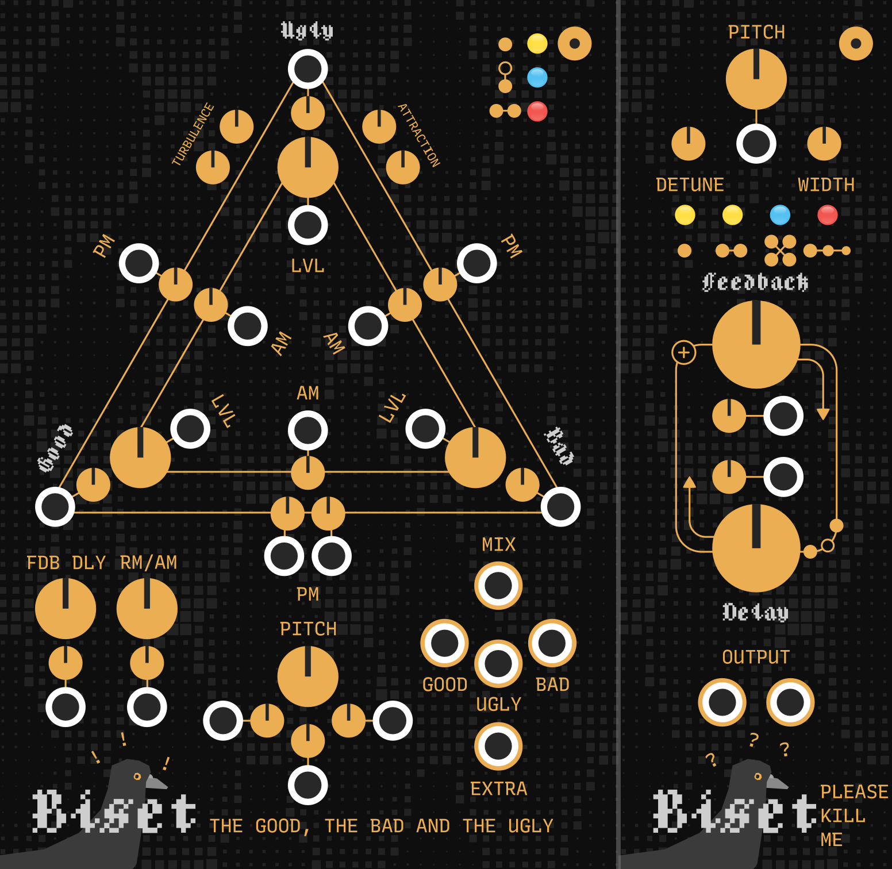

# Biset

**Biset** sequencing / performing / vco modules.

[Donations are welcome](https://www.paypal.com/paypalme/bisousbiset)

For **question**, **bug report** or **feature request**, feel free to contact me
by email or create a **github issue** (easier for me for report or request).
You can see the past and comming updates at the bottom of the document.

## VCOs

**The Good, the Bad and the Ugly** and **Please kill me** are VCOs based on
**Frequency** (**Phase**), **amplitude** and **ring** modulation.
They are designed to add some spring and inertia to sound.

## Tracker

**Tracker** is a series of modules building a complex sequencer based on
**patterns** arranged in a **timeline**.
It can be used to build complex **tracks** or for **live performance**.

[Tracker walk through](https://www.youtube.com/watch?v=dUq9HsWwDsw)

[Tracker manual](./doc/Manual-Tracker.pdf)

## Regex

**Regex** and **Regex-Condensed** are **live coding** modules. They can generate
**clock** (rythm), **pitch** and **modulation** sequences.

[Regex walk through](https://www.youtube.com/watch?v=hXMN2y9V8K0)

[Regex manual](./doc/Manual-Regex.pdf)

## Other modules

### Tree

**Tree** is a random sequencer based on Tree growth simulation.

### Segfault

**Segfault** is designed to be used with **VCV - Midi to CV** module while
performing on your Qwerty or Midi keyboard.
It allows you to send triggers on specific notes and to disable some of them.

It might sound weird but it actually allows you to **rethink your keyboard
layout** !

As an **exemple**, I **disable all the black keys** and use them as **triggers**
to activate other things on my patch.
The **remaining white keys**, which make up the **major scale**, can then be
quantized to any other **7 notes scale** (so most of the scales).
I can then play any 7 notes scale only with the **white keys** and use the
**black keys** gates / triggers to change the synth, the scale / quantizer or
anything else :)

Of course, you can use it in a different way. Like by using the notes triggers
to activate a different synth for every note.

**Segfault** takes **pitch** and **gate** (polyphonic) as input and outputs the
modified gate (if needed).

If the **gate** input is not provided, it is considered **up** by default.

## Updates

### 2.0.8 (coming)

- Tracker
	- [x] Fixed `c` effect crash
	- [x] Shortcut `space` to add note stop
	- [x] Shortcut `arrow` keys to move timeline camera
	- [x] Shortcut `delete` to remove pattern instance
	- [ ] Shortcut `insert` / `suppr` to move lines
- Regex
	- [x] Inline `x` modulator multiplication
	- [x] Fixed / enhanced bias knob
	- [x] Added `*` clock modulator !
	- [x] Can run on start-up (context menu)
	- [x] Gate output expander
- Please kill me
	- [x] Fixed no pitch input no output issue

### 2.0.7 (jan 4, 2024)

- [x] New **Please kill me** synth module !
- [x] New **The good, the bad and the ugly** synth module !
- [x] New **Tree** sequencer module !
- [x] New **T-Control** tracker module !
- Tracker
	- [x] Fixed empty pattern crash
	- [x] Allows record on both playing modes
